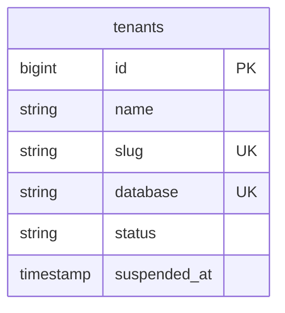
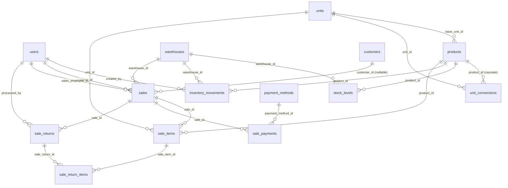
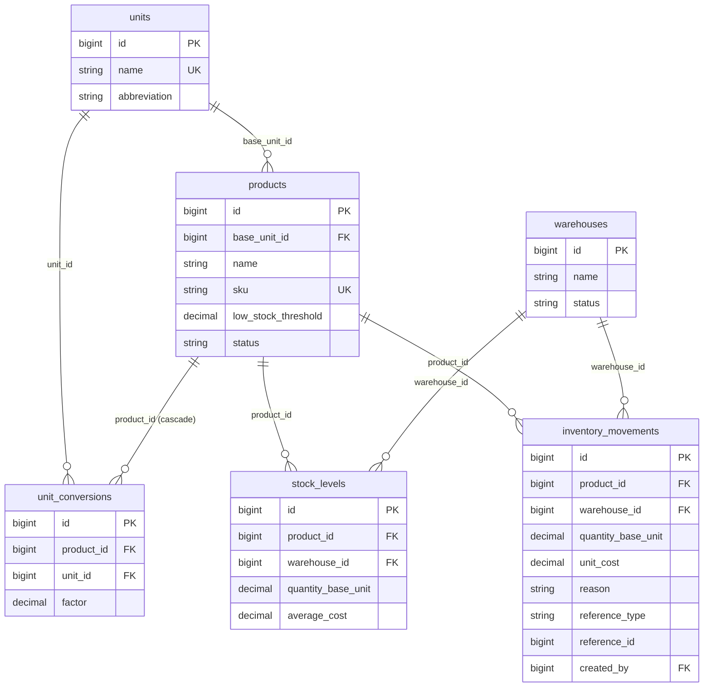
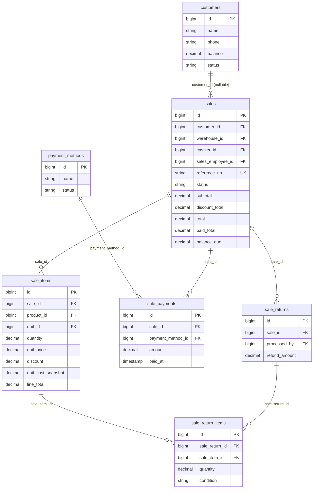
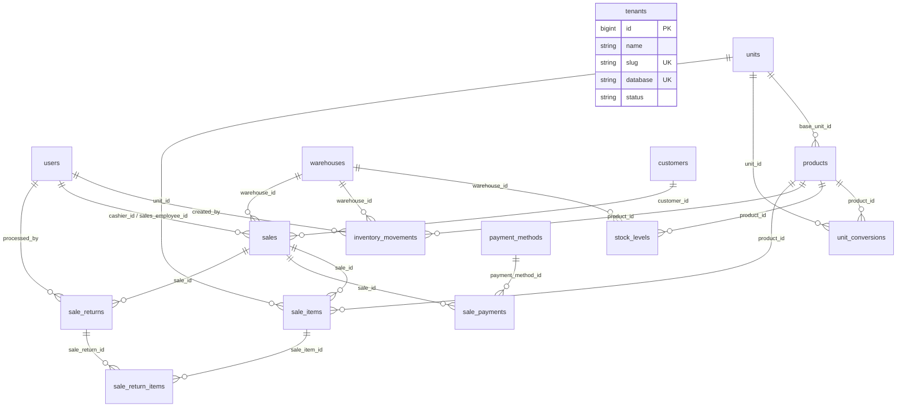

# Current Database Documentation

Read-only, table-by-table documentation of the database as it exists today — every column, constraint, relationship, and Mermaid ERD transcribed directly from the current migrations. Nothing proposed, nothing planned, nothing renamed. Where a table or relationship doesn't exist, this document says so rather than filling the gap.

**Source**: 1 landlord migration + 16 tenant migrations
**Engine**: SQLite
**Mode**: Read-only — no repository files modified in producing this document

---

## Table of Contents

1. [Database overview](#1-database-overview)
2. [Table inventory](#2-table-inventory)
3. [Landlord: tenants](#3-landlord-tenants)
4. [Products & units](#4-products--units)
5. [Inventory](#5-inventory)
6. [Warehouses](#6-warehouses)
7. [Customers & payments](#7-customers--payments)
8. [Sales](#8-sales)
9. [Auth / framework infrastructure](#9-auth--framework-infrastructure)
10. [Relationships](#10-relationships)
11. [Tenant architecture](#11-tenant-architecture)
12. [Mermaid ERDs](#12-mermaid-erds)
13. [Not currently in the database](#13-not-currently-in-the-database)
14. [Suspicious / inconsistent findings](#14-suspicious--inconsistent-findings)

---

## 1. Database overview

Two databases exist, related only through one row of metadata — never through a shared schema, a foreign key, or a query that spans both.

### Landlord database — 1 file

One SQLite file: `database/landlord.sqlite` (connection name `landlord` in `config/database.php`). Holds exactly one table: `tenants`. Nothing else — no plans, no subscriptions, no platform admin accounts exist as tables.

### Tenant databases — N files, one per tenant

One SQLite file per tenant, at `database/tenants/<database-column-value>.sqlite` (connection name `tenant`, repointed at runtime). Each tenant's file is an independent, structurally identical copy of the same 16-table schema — running the same set of tenant migrations produces every tenant's database.

### How the two relate

A tenant database is located by reading its filename off the landlord's `tenants.database` column. That's the entire relationship — there is no foreign key from any tenant table back to the landlord's `tenants` row, and no foreign key could exist, since SQLite (and this architecture) never lets a single query span two separate database files. The connection between them is application code (`TenantConnectionFactory`), not a database-level constraint.

---

## 2. Table inventory

All 21 tables currently defined across both databases, by migration.

| Migration file | Database | Table(s) created |
|---|---|---|
| `0001_01_01_000000_create_tenants_table` | landlord | `tenants` |
| `0001_01_01_000000_create_users_table` | tenant | `users, password_reset_tokens, sessions` |
| `0001_01_01_000001_create_cache_table` | tenant | `cache, cache_locks` |
| `0001_01_01_000002_create_jobs_table` | tenant | `jobs, job_batches, failed_jobs` |
| `0002_01_01_000000_create_units_table` | tenant | `units` |
| `0002_01_01_000001_create_warehouses_table` | tenant | `warehouses` |
| `0002_01_01_000002_create_products_table` | tenant | `products` |
| `0002_01_01_000003_create_unit_conversions_table` | tenant | `unit_conversions` |
| `0003_01_01_000000_create_stock_levels_table` | tenant | `stock_levels` |
| `0003_01_01_000001_create_inventory_movements_table` | tenant | `inventory_movements` |
| `0004_01_01_000000_create_payment_methods_table` | tenant | `payment_methods` |
| `0004_01_01_000001_create_customers_table` | tenant | `customers` |
| `0005_01_01_000000_create_sales_table` | tenant | `sales` |
| `0005_01_01_000001_create_sale_items_table` | tenant | `sale_items` |
| `0005_01_01_000002_create_sale_payments_table` | tenant | `sale_payments` |
| `0005_01_01_000003_create_sale_returns_table` | tenant | `sale_returns` |
| `0005_01_01_000004_create_sale_return_items_table` | tenant | `sale_return_items` |

No `deleted_at` column and no `SoftDeletes` trait usage exists on any table in any migration — confirmed by reading all 17 files directly. Nothing in this schema soft-deletes.

---

## 3. Landlord: tenants

### `tenants` (landlord DB)

| Column | Type | Null | Default | Key |
|---|---|---|---|---|
| id | bigint | NOT NULL | — | PK |
| name | string | NOT NULL | — | — |
| slug | string | NOT NULL | — | UNIQUE |
| database | string | NOT NULL | — | UNIQUE |
| status | string | NOT NULL | `'provisioning'` | — |
| suspended_at | timestamp | nullable | — | — |
| created_at, updated_at | timestamp | nullable | — | — |

**Foreign keys**: none
**Indexes**: none beyond the two unique constraints
**Soft delete**: no

---

## 4. Products & units

### `units` (tenant DB)

| Column | Type | Null | Default | Key |
|---|---|---|---|---|
| id | bigint | NOT NULL | — | PK |
| name | string(30) | NOT NULL | — | UNIQUE |
| abbreviation | string(10) | nullable | — | — |
| created_at, updated_at | timestamp | nullable | — | — |

**Foreign keys**: none

### `products` (tenant DB)

| Column | Type | Null | Default | Key |
|---|---|---|---|---|
| id | bigint | NOT NULL | — | PK |
| base_unit_id | bigint | NOT NULL | — | FK → units.id (restrict) |
| name | string(150) | NOT NULL | — | — |
| sku | string(64) | nullable | — | UNIQUE |
| low_stock_threshold | decimal(14,4) | nullable | — | — |
| status | string(20) | NOT NULL | `'active'` | indexed |
| created_at, updated_at | timestamp | nullable | — | — |

**Foreign keys**: base_unit_id → units.id
**Indexes**: status

### `unit_conversions` (tenant DB)

| Column | Type | Null | Default | Key |
|---|---|---|---|---|
| id | bigint | NOT NULL | — | PK |
| product_id | bigint | NOT NULL | — | FK → products.id (**cascade** on delete) |
| unit_id | bigint | NOT NULL | — | FK → units.id (restrict) |
| factor | decimal(12,4) | NOT NULL | — | — |
| created_at, updated_at | timestamp | nullable | — | — |

**Unique**: (product_id, unit_id)
**Note**: the only cascade-on-delete FK in the entire schema — every other FK is restrict

---

## 5. Inventory

### `stock_levels` (tenant DB)

| Column | Type | Null | Default | Key |
|---|---|---|---|---|
| id | bigint | NOT NULL | — | PK |
| product_id | bigint | NOT NULL | — | FK → products.id (restrict) |
| warehouse_id | bigint | NOT NULL | — | FK → warehouses.id (restrict) |
| quantity_base_unit | decimal(14,4) | NOT NULL | `0` | — |
| average_cost | decimal(14,4) | NOT NULL | `0` | — |
| created_at, updated_at | timestamp | nullable | — | — |

**Unique**: (product_id, warehouse_id)

### `inventory_movements` (tenant DB)

| Column | Type | Null | Default | Key |
|---|---|---|---|---|
| id | bigint | NOT NULL | — | PK |
| product_id | bigint | NOT NULL | — | FK → products.id (restrict) |
| warehouse_id | bigint | NOT NULL | — | FK → warehouses.id (restrict) |
| quantity_base_unit | decimal(14,4) | NOT NULL | — | signed |
| unit_cost | decimal(14,4) | NOT NULL | — | — |
| reason | string(20) | NOT NULL | — | indexed |
| reference_type | string(60) | nullable | — | indexed (composite) |
| reference_id | unsigned bigint | nullable | — | indexed (composite) |
| created_by | bigint | nullable | — | FK → users.id (restrict) |
| created_at, updated_at | timestamp | nullable | — | — |

**Indexes**: (product_id, warehouse_id, created_at) · (reference_type, reference_id) · reason

---

## 6. Warehouses

### `warehouses` (tenant DB)

| Column | Type | Null | Default | Key |
|---|---|---|---|---|
| id | bigint | NOT NULL | — | PK |
| name | string(150) | NOT NULL | — | — |
| status | string(20) | NOT NULL | `'active'` | indexed |
| created_at, updated_at | timestamp | nullable | — | — |

**Foreign keys**: none — no `branch_id` column exists (the migration's own comment states this is deliberately scoped down, no Branches module exists)

---

## 7. Customers & payments

### `customers` (tenant DB)

| Column | Type | Null | Default | Key |
|---|---|---|---|---|
| id | bigint | NOT NULL | — | PK |
| name | string(150) | NOT NULL | — | — |
| phone | string(30) | nullable | — | indexed |
| balance | decimal(14,2) | NOT NULL | `0` | — |
| status | string(20) | NOT NULL | `'active'` | indexed |
| created_at, updated_at | timestamp | nullable | — | — |

**Foreign keys**: none

### `payment_methods` (tenant DB)

| Column | Type | Null | Default | Key |
|---|---|---|---|---|
| id | bigint | NOT NULL | — | PK |
| name | string(60) | NOT NULL | — | — |
| status | string(20) | NOT NULL | `'active'` | — |
| created_at, updated_at | timestamp | nullable | — | — |

**Foreign keys**: none
**Note**: no unique constraint on `name` — two payment methods could currently be created with an identical name

---

## 8. Sales

### `sales` (tenant DB)

| Column | Type | Null | Default | Key |
|---|---|---|---|---|
| id | bigint | NOT NULL | — | PK |
| customer_id | bigint | nullable | — | FK → customers.id (restrict) |
| warehouse_id | bigint | NOT NULL | — | FK → warehouses.id (restrict) |
| cashier_id | bigint | NOT NULL | — | FK → users.id (restrict) |
| sales_employee_id | bigint | nullable | — | FK → users.id (restrict) |
| reference_no | string(30) | NOT NULL | — | UNIQUE |
| status | string(20) | NOT NULL | `'confirmed'` | indexed (composite) |
| subtotal | decimal(14,2) | NOT NULL | — | — |
| discount_total | decimal(14,2) | NOT NULL | `0` | — |
| total | decimal(14,2) | NOT NULL | — | — |
| paid_total | decimal(14,2) | NOT NULL | `0` | — |
| balance_due | decimal(14,2) | NOT NULL | `0` | — |
| notes | text | nullable | — | — |
| confirmed_at | timestamp | nullable | — | — |
| cancelled_at | timestamp | nullable | — | — |
| created_at, updated_at | timestamp | nullable | — | — |

**Indexes**: (customer_id, status, created_at) · (status, created_at) · sales_employee_id
**Note**: no `refunded` status value is enforced at the DB level — `status` is a plain string column, not a DB-level enum/check constraint

### `sale_items` (tenant DB)

| Column | Type | Null | Default | Key |
|---|---|---|---|---|
| id | bigint | NOT NULL | — | PK |
| sale_id | bigint | NOT NULL | — | FK → sales.id (restrict) |
| product_id | bigint | NOT NULL | — | FK → products.id (restrict) |
| unit_id | bigint | NOT NULL | — | FK → units.id (restrict) |
| quantity | decimal(14,4) | NOT NULL | — | — |
| unit_price | decimal(14,4) | NOT NULL | — | — |
| discount | decimal(14,2) | NOT NULL | `0` | — |
| unit_cost_snapshot | decimal(14,4) | NOT NULL | — | — |
| line_total | decimal(14,2) | NOT NULL | — | — |
| created_at, updated_at | timestamp | nullable | — | — |

**Indexes**: sale_id · product_id

### `sale_payments` (tenant DB)

| Column | Type | Null | Default | Key |
|---|---|---|---|---|
| id | bigint | NOT NULL | — | PK |
| sale_id | bigint | NOT NULL | — | FK → sales.id (restrict) |
| payment_method_id | bigint | NOT NULL | — | FK → payment_methods.id (restrict) |
| amount | decimal(14,2) | NOT NULL | — | — |
| paid_at | timestamp | NOT NULL | — | — |
| created_at, updated_at | timestamp | nullable | — | — |

**Indexes**: sale_id · payment_method_id

### `sale_returns` (tenant DB)

| Column | Type | Null | Default | Key |
|---|---|---|---|---|
| id | bigint | NOT NULL | — | PK |
| sale_id | bigint | NOT NULL | — | FK → sales.id (restrict) |
| processed_by | bigint | NOT NULL | — | FK → users.id (restrict) |
| refund_amount | decimal(14,2) | NOT NULL | — | — |
| notes | text | nullable | — | — |
| created_at, updated_at | timestamp | nullable | — | — |

**Indexes**: sale_id

### `sale_return_items` (tenant DB)

| Column | Type | Null | Default | Key |
|---|---|---|---|---|
| id | bigint | NOT NULL | — | PK |
| sale_return_id | bigint | NOT NULL | — | FK → sale_returns.id (restrict) |
| sale_item_id | bigint | NOT NULL | — | FK → sale_items.id (restrict) |
| quantity | decimal(14,4) | NOT NULL | — | — |
| condition | string(20) | NOT NULL | `'sellable'` | — |
| created_at, updated_at | timestamp | nullable | — | — |

**Indexes**: sale_return_id · sale_item_id

---

## 9. Auth / framework infrastructure

Stock Laravel tables, present because they ship with the framework skeleton — not built for this project, and (aside from `users`, which is the FK target for every actor column above) not used by any feature yet.

| Table | Purpose | Used by app code? |
|---|---|---|
| `users` | id, name, email (unique), email_verified_at, password, remember_token, timestamps | Yes — FK target for cashier_id, sales_employee_id, created_by, processed_by |
| `password_reset_tokens` | email (PK), token, created_at | No — no password-reset flow exists |
| `sessions` | id (PK), user_id, ip_address, user_agent, payload, last_activity | No — `SESSION_DRIVER=file`, this table is unused |
| `cache`, `cache_locks` | Laravel's database cache driver tables | No — `CACHE_STORE=file` |
| `jobs`, `job_batches`, `failed_jobs` | Laravel's database queue driver tables | No — `QUEUE_CONNECTION=sync`, no jobs exist in the codebase |

---

## 10. Relationships

Every foreign-key relationship that actually exists in the migrations — nothing implied, nothing planned.

| From | To | On delete |
|---|---|---|
| `products.base_unit_id` | `units.id` | restrict |
| `unit_conversions.product_id` | `products.id` | **cascade** |
| `unit_conversions.unit_id` | `units.id` | restrict |
| `stock_levels.product_id` | `products.id` | restrict |
| `stock_levels.warehouse_id` | `warehouses.id` | restrict |
| `inventory_movements.product_id` | `products.id` | restrict |
| `inventory_movements.warehouse_id` | `warehouses.id` | restrict |
| `inventory_movements.created_by` | `users.id` | restrict |
| `sales.customer_id` | `customers.id` | restrict (nullable) |
| `sales.warehouse_id` | `warehouses.id` | restrict |
| `sales.cashier_id` | `users.id` | restrict |
| `sales.sales_employee_id` | `users.id` | restrict (nullable) |
| `sale_items.sale_id` | `sales.id` | restrict |
| `sale_items.product_id` | `products.id` | restrict |
| `sale_items.unit_id` | `units.id` | restrict |
| `sale_payments.sale_id` | `sales.id` | restrict |
| `sale_payments.payment_method_id` | `payment_methods.id` | restrict |
| `sale_returns.sale_id` | `sales.id` | restrict |
| `sale_returns.processed_by` | `users.id` | restrict |
| `sale_return_items.sale_return_id` | `sale_returns.id` | restrict |
| `sale_return_items.sale_item_id` | `sale_items.id` | restrict |

21 foreign keys total. 20 of them `restrict` on delete; exactly one (`unit_conversions.product_id`) cascades.

---

## 11. Tenant architecture

| Question | Answer, verified against migrations/config |
|---|---|
| Landlord/global tables | Exactly one: `tenants` |
| Tenant-database tables | All other 20 tables |
| Does `tenant_id` exist anywhere? | **No.** Confirmed by reading every column in every migration — no table in either database has a `tenant_id` column. |
| Isolation model | **Database-based, not row-based.** Each tenant's data lives in a physically separate SQLite file (`database/tenants/<slug>.sqlite`), not in shared tables filtered by a tenant column. |
| How isolation is enforced | `config/database.php` defines a `tenant` connection with `'database' => null` as a template. At runtime, application code repoints that connection to one tenant's file before any query runs. |

This matches what the previous audit report stated: one landlord SQLite database, a separate SQLite database per tenant, no `tenant_id` columns. Re-verified directly against the migrations for this document rather than copied forward.

---

## 12. Mermaid ERDs

### A. Landlord database

One table, no relationships.

### B. Tenant database (business tables only)

All 15 business tables — auth/cache/jobs infrastructure tables omitted for legibility, see §9 for those.

### C. Products + Inventory

### D. Purchases / Suppliers

**Not implemented.**

No `suppliers`, `purchases`, `purchase_items`, or `purchase_payments` tables exist in any migration. There is nothing to diagram.

### E. Customers + Sales + Payments

### F. Consolidated — everything that currently exists

Landlord + tenant business tables together, for orientation only — remember these are two separate physical databases with no queryable link between them (§1).

---

## 13. Not currently in the database

Business areas with zero table representation — verified by the absence of any matching `Schema::create()` call across all 17 migration files.

- **Suppliers** — No table. No supplier balance/ledger exists.
- **Purchases** — No table — not even a header table. The word "purchase" appears only in `inventory_movements.reason` as a string value and in two Action class names that reference it as a concept, never as a schema.
- **Purchase returns** — No table — same situation as purchases.
- **Expenses** — No table.
- **Cash register / cash sessions** — No table.
- **Employees** — No table. `sales.sales_employee_id` points at `users`, not at an employees table.
- **Partners, partner ownership, partner capital, partner withdrawals** — No tables.
- **Profit sharing** — No table.
- **Accounting (chart of accounts, journal entries)** — No tables.
- **Audit logs** — No table.
- **Branches** — No table. `warehouses` has no `branch_id` column.
- **Roles / Permissions** — No tables.
- **Business profile / tenant settings** — No table beyond `tenants` itself — no address, currency, or configuration storage.
- **Plans / subscriptions** — No tables, not even on the landlord side.
- **Product categories, product variants** — No tables — `products` has no `category_id` column.

---

## 14. Suspicious / inconsistent findings

Reported only, per instruction — nothing here was changed.

| Finding | Detail |
|---|---|
| The one cascade-on-delete FK in an otherwise all-restrict schema | `unit_conversions.product_id` cascades when every other FK in the schema — including sibling table `unit_conversions.unit_id` in the very same migration — restricts. Deleting a product would silently delete its unit conversion rows, which is inconsistent with the restrict-everywhere pattern used for every other table, though products themselves have no delete route in the application code today (per the prior audit), so this is currently unreachable rather than actively dangerous. |
| No unique constraint on `payment_methods.name` | Two rows named "Cash" could exist side by side; nothing in the schema prevents it. |
| `sales.status` and `inventory_movements.reason` are plain strings, not DB-level enums | Both are constrained only by application code (a PHP enum on the model side, per the earlier audit), not by a database `CHECK` constraint or a foreign key to a lookup table — a direct `INSERT` bypassing the application layer could write an arbitrary string into either column. |
| `warehouses` has no foreign key pointing into it from anything except `stock_levels`, `inventory_movements`, and `sales` | Not an inconsistency, just worth noting for orientation: a warehouse can be referenced by a sale without that warehouse ever having a `stock_levels` row for the product being sold — the schema itself doesn't prevent selling from a warehouse with zero recorded stock; that's enforced only in application code (per the prior audit's inventory trace), not at the database level. |

---

*Ledger & Loom — Database Documentation · Read-only, transcribed directly from 17 migration files · No files modified*
