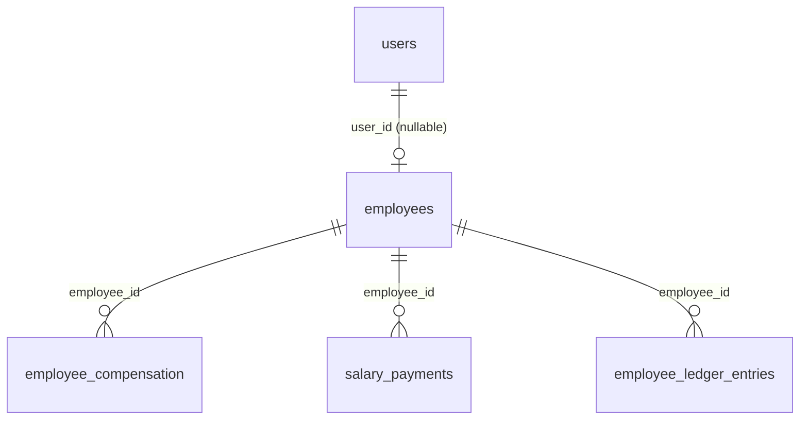
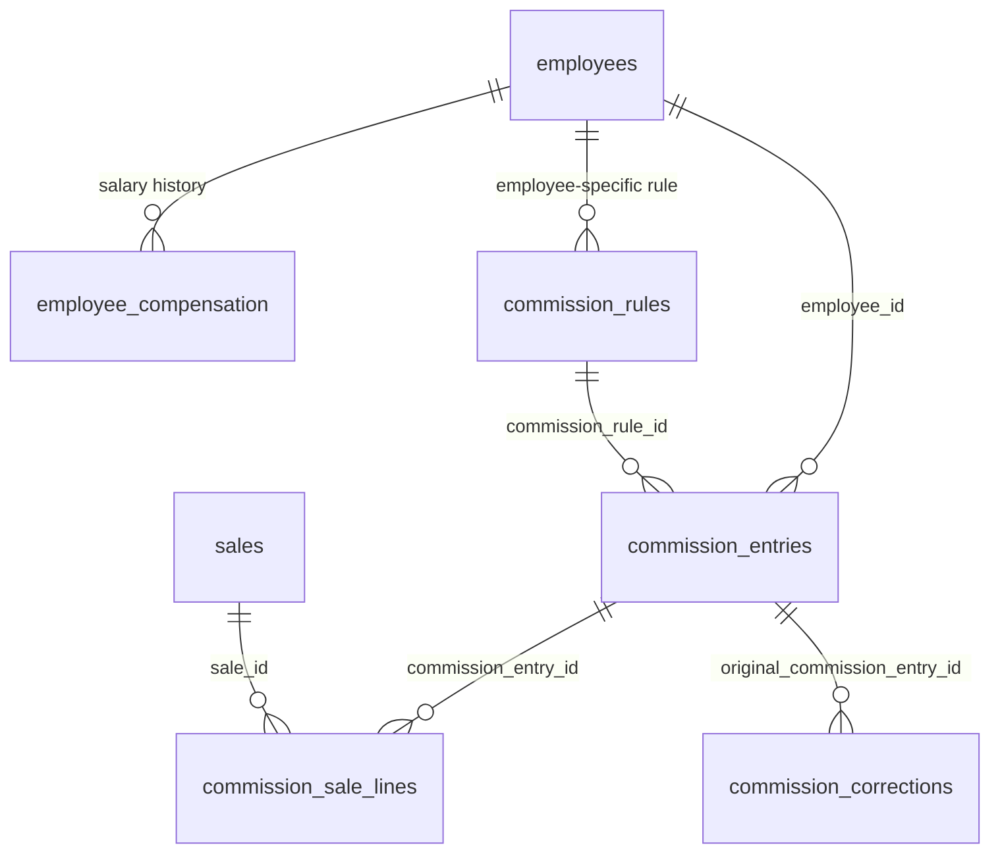
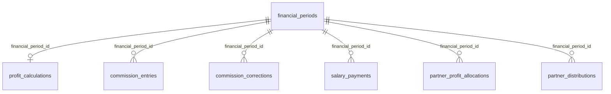
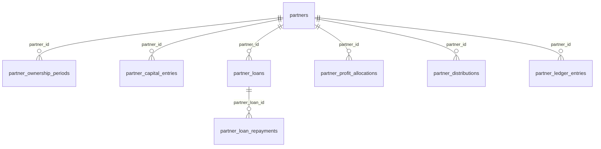
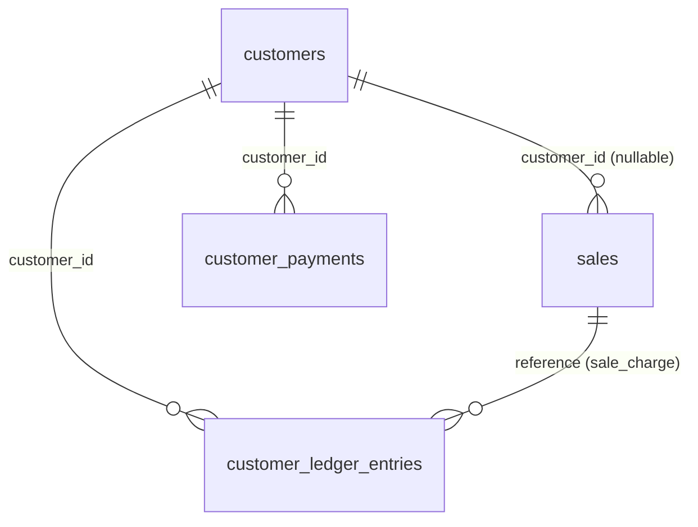
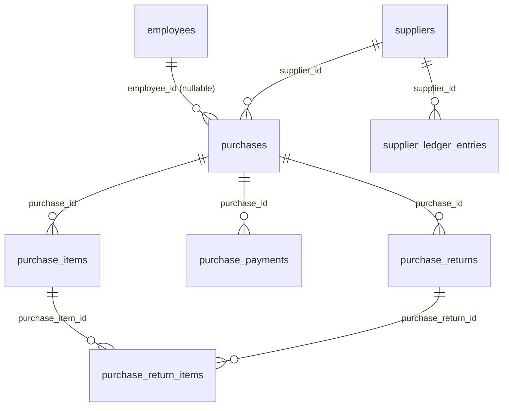
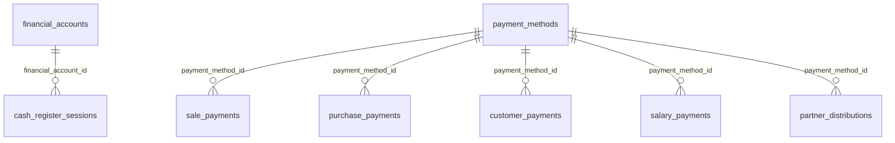
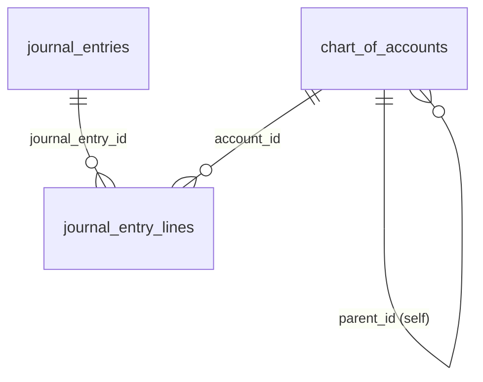

# The Financial Schema, Finalized on Paper First

Design only — no code, migrations, models, or repository changes were made in producing this document. Four business decisions confirmed this turn, folded into a final authoritative rule set, a complete conceptual + schema-level design for Employees, Salary, Commission, Financial Periods, Partners, Customer/Supplier ledgers, Cash/Bank accounts, and Accounting readiness — plus exactly which existing tables change, which stay, and what's new.

**Confirms**: Commission basis · Forward correction · Retained profit · Shared Financial Period
**Builds on**: Codebase audit → ERD documentation → Gap analysis → Financial domain specification

---

## Table of Contents

- [A. Final confirmed business rules](#a-final-confirmed-business-rules)
- [B. Employee design](#b-employee-design)
- [C. Salary design](#c-salary-design)
- [D. Commission design](#d-commission-design)
- [E. Financial Period design](#e-financial-period-design)
- [F. Partner design](#f-partner-design)
- [G. Capital vs. Loan](#g-capital-vs-loan)
- [H. Customer ledger](#h-customer-ledger)
- [I. Supplier + Purchase](#i-supplier--purchase)
- [J. Cash / Bank / Payments](#j-cash--bank--payments)
- [K. Accounting-ready design](#k-accounting-ready-design)
- [L. Existing table changes](#l-existing-table-changes)
- [M. New tables](#m-new-tables)
- [N. Complete ERD](#n-complete-erd)
- [O. Data migration considerations](#o-data-migration-considerations)
- [P. Remaining unresolved decisions](#p-remaining-unresolved-decisions)
- [Q. Recommended next step](#q-recommended-next-step)

---

## A. Final confirmed business rules

The prior financial specification, updated with this turn's four decisions. This supersedes the open items in the earlier document's §M.

| Concept | Financial effect | Lifecycle |
|---|---|---|
| Revenue | Increases profit; no direct cash effect | Recognized at sale confirmation (unchanged) |
| Sales | The document producing Revenue/COGS | Draft-free — confirmed atomically (unchanged) |
| COGS | Decreases profit; no direct cash effect | Frozen per line at sale confirmation (unchanged) |
| Gross Profit | = Revenue − COGS | Derived per sale, aggregated per Financial Period |
| Operating Expenses | Decrease Net Profit; affect cash when paid | Recognized when incurred, accrue into the open Financial Period |
| Employee Salary | True operating expense; affects cash when paid | Effective-dated structure, accrues every period regardless of sales activity |
| Employee Commission | True operating expense, additive to salary — **confirmed: never an offset** | **Confirmed: accrual-based at sale confirmation**, on Gross Profit, independent of collection status |
| Net Profit | = Gross Profit − Operating Expenses (incl. salary + commission) | Finalized once a Financial Period closes |
| Retained Profit | Portion of Net Profit not marked distributable — **confirmed: explicitly selected, not automatic** | Set when a Financial Period's distributable amount is determined |
| Partner Capital | Equity — no profit effect | Recorded on contribution, permanent until withdrawn |
| Partner Loan | Liability — no profit effect (interest, if ever charged, would be an expense) | Recorded on issue, reduced by repayments |
| Partner Withdrawal | Reduces equity — no profit effect | Independent of any specific period's allocation |
| Partner Profit Allocation | Calculated entitlement from Distributable Profit × ownership % | Computed once a period's Distributable Profit is known |
| Partner Profit Distribution | Reduces retained earnings, increases cash-out | The actual payout of an allocation — a separate event from the allocation itself |
| Customer Receivable | Asset, not a profit event | Created on credit sale, reduced by payment/return |
| Supplier Payable | Liability, not a profit event | Created on credit purchase, reduced by payment/return |
| Cash | Asset, not itself a profit event | Moved by nearly every other transaction |
| Bank / Payment Accounts | Asset, not itself a profit event | Same as Cash, non-physical rail |
| Financial Period | N/A — the container everything above finalizes into | **Confirmed: OPEN → CALCULATING → UNDER_REVIEW → CLOSED**, one shared concept, not separate systems |

### How each confirmed decision is now structurally encoded

- **Commission basis/timing** → `commission_entries.eligible_gross_profit` is computed from confirmed sales the instant a period calculates, never gated on `sales.paid_total` (§D).
- **Forward correction** → `commission_corrections` always references the *currently open* period, never edits a closed `commission_entries` row (§D).
- **Retained profit** → `profit_calculations.distributable_profit` and `.retained_profit` are explicit, independently-set columns that must sum to `net_profit`, never a hard-coded 100% (§E).
- **Shared period** → one `financial_periods` table, referenced by commission, profit, and (later) expenses — no parallel period system (§E).

---

## B. Employee design

An Employee is a compensation subject. A User is a login identity. Related by an optional reference, never merged.

| Scenario | Design |
|---|---|
| Employee without login | `employees.user_id` is null — full salary/commission tracking with no User row at all |
| Employee with login | `employees.user_id` points at a `users` row; the two lifecycles stay independent |
| Active / inactive / terminated | `employees.status` — status change only, never a delete, matching the immutability pattern used everywhere else in this codebase |
| Employee profile | Name, phone, hired_at on `employees` itself |
| Employment dates | `hired_at` / `terminated_at` on `employees` |
| Employee changes login account | Only `employees.user_id` is repointed — every historical sale/commission row references the Employee, not the User, so nothing downstream is affected |

### `employees` — New table

Purpose: the compensation-subject entity. Never the same row as a User.

| Column | Type | Constraint |
|---|---|---|
| user_id | bigint | FK → users.id, nullable, restrict |
| name | string(150) | not null |
| phone | string(30) | nullable |
| hired_at | date | not null |
| terminated_at | date | nullable |
| status | string(20) | not null, default 'active' — active/inactive/terminated |

Tenant-scoped. Indexes: user_id, status.

### How `sales.sales_employee_id` should eventually relate to Employee

The FK target changes from `users.id` to `employees.id` — the column name and its meaning ("who gets commission credit for this sale") stay exactly the same, only what it points at changes. This is deliberately kept separate from `sales.cashier_id`, which correctly continues to point at `users.id`: the cashier is "who was logged in and processed the transaction" (a system-access fact), while the sales employee is "who earns commission for this sale" (a compensation fact) — the same User/Employee distinction this whole section is built around, applied to the one place Sales already touches it.

---

## C. Salary design

### `employee_compensation` — New table

Purpose: effective-dated salary. A raise is a new row, never an edit — a salary change must never rewrite history.

| Column | Type | Constraint |
|---|---|---|
| employee_id | bigint | FK → employees.id, not null, restrict |
| monthly_salary | decimal(14,2) | not null |
| effective_from | date | not null |
| effective_to | date | nullable — open-ended until superseded |

Indexes: (employee_id, effective_from).

### `salary_payments` — New table

Purpose: actual payout events — immutable, one row per payout, never edited.

| Column | Type | Constraint |
|---|---|---|
| employee_id | bigint | FK → employees.id, not null, restrict |
| financial_period_id | bigint | FK → financial_periods.id, not null, restrict |
| amount | decimal(14,2) | not null |
| payment_method_id | bigint | FK → payment_methods.id, not null, restrict |
| paid_at | timestamp | not null |
| created_by | bigint | FK → users.id, not null, restrict |

Indexes: employee_id, financial_period_id.

**Unpaid/accrued salary**: derived, not stored redundantly — the difference between what `employee_compensation` says was owed for a period and what `salary_payments` actually paid.

**Salary correction**: never an edit to a past `salary_payments` row — a correction is a new `employee_ledger_entries` adjustment (§B/§D share this ledger, defined once in §D).

**Out of scope, explicitly**: payroll tax, benefits, overtime, and attendance — none are implied by anything in the confirmed business rules; marked future scope, not designed here.

---

## D. Commission design

Confirmed basis: Gross Profit. Confirmed timing: accrual at sale confirmation. Confirmed correction: forward, into the current open period.

### `commission_rules` — New table

Purpose: configurable, effective-dated. `employee_id` null means a tenant-wide default rule — never hard-coded to one person.

| Column | Type | Constraint |
|---|---|---|
| employee_id | bigint | FK → employees.id, nullable, restrict — null = default/tenant-wide rule |
| basis | string(20) | not null, default 'gross_profit' — confirmed value; kept as a column, not hard-coded, since the architecture principle is "configurable," even though only one basis is confirmed today |
| rate | decimal(5,2) | not null — 0–100 |
| effective_from | date | not null |
| effective_to | date | nullable |
| status | string(20) | not null, default 'active' |

Indexes: employee_id, (status, effective_from).

### `commission_entries` — New table

Purpose: one row per employee per rule per Financial Period — the finalized, immutable commission result.

> **Correction (2026-08-29, confirmed by the business owner):** `eligible_gross_profit` is the tenant's TOTAL gross profit for the period — every confirmed sale, not just this employee's own. The row below originally said "this employee's confirmed sales," which was wrong: the confirmed rule is 10% of the whole shop's profit paid to the commission-earning employee, not 10% of what they personally sold. `commission_sale_lines` (below) is affected the same way — it traces every sale in the period, not one employee's sales. Implemented correctly in `App\Modules\Commission\Actions\CalculateCommissionForPeriod`.

| Column | Type | Constraint |
|---|---|---|
| employee_id | bigint | FK → employees.id, not null, restrict |
| commission_rule_id | bigint | FK → commission_rules.id, not null, restrict |
| financial_period_id | bigint | FK → financial_periods.id, not null, restrict |
| eligible_gross_profit | decimal(14,2) | not null — the tenant's TOTAL confirmed-sales (revenue − COGS) for the period (see correction note above) |
| rate_applied | decimal(5,2) | not null — snapshot of the rule's rate at calculation time; the rule itself may change later, this never does |
| commission_amount | decimal(14,2) | not null |
| status | string(20) | not null — calculated · approved · finalized · paid |
| approved_by | bigint | FK → users.id, nullable, restrict |

Unique: (employee_id, commission_rule_id, financial_period_id). Indexes: financial_period_id, status.

### `commission_sale_lines` — New table

Purpose: traceability — exactly which sales contributed to a commission_entry — required so a later return can be matched back to the specific entry it should forward-correct against.

| Column | Type | Constraint |
|---|---|---|
| commission_entry_id | bigint | FK → commission_entries.id, not null, restrict |
| sale_id | bigint | FK → sales.id, not null, restrict |
| eligible_gross_profit | decimal(14,2) | not null — this sale's individual contribution |

Indexes: commission_entry_id, sale_id.

### `commission_corrections` — New table

Purpose: confirmed forward-correction mechanism. Never edits `commission_entries` — always lands in whichever period is open when the correction is created.

| Column | Type | Constraint |
|---|---|---|
| employee_id | bigint | FK → employees.id, not null, restrict |
| original_commission_entry_id | bigint | FK → commission_entries.id, not null, restrict — the closed-period entry this corrects |
| financial_period_id | bigint | FK → financial_periods.id, not null, restrict — the CURRENT open period the correction lands in |
| reason | string(30) | not null — sale_return · sale_cancellation · manual_adjustment |
| amount | decimal(14,2) | not null, signed — negative for a clawback |
| reference_type | string(60) | nullable — polymorphic, e.g. SaleReturn |
| reference_id | bigint | nullable |
| created_by | bigint | FK → users.id, not null, restrict |

Indexes: employee_id, original_commission_entry_id, financial_period_id.

### `employee_ledger_entries` — New table

Purpose: unifying running statement per employee — salary accruals/payments, commission accruals/payments, and corrections, all in one feed. Shared by §C and §D rather than each maintaining a separate history.

| Column | Type | Constraint |
|---|---|---|
| employee_id | bigint | FK → employees.id, not null, restrict |
| entry_type | string(30) | not null — salary_accrual · salary_payment · commission_accrual · commission_payment · commission_correction |
| amount | decimal(14,2) | not null, signed |
| financial_period_id | bigint | FK → financial_periods.id, nullable, restrict |
| reference_type | string(60) | nullable — polymorphic |
| reference_id | bigint | nullable |

Indexes: employee_id, (reference_type, reference_id).

### Returns and cancellations

| Event | Effect on commission |
|---|---|
| Sale returned, same period, before finalization | The return's reversed gross profit simply isn't included when the period's `commission_entries` are calculated — no correction needed, since nothing was finalized yet |
| Sale returned, after the period's commission is finalized | A `commission_corrections` row is created, referencing the original entry, landing in the currently open period, amount negative — **confirmed forward correction** |
| Sale cancelled before period close | Same as an early return — a cancelled sale contributes zero eligible profit when the period calculates, since `ConfirmSale`'s Sale.status would already be Cancelled by then |
| Sale cancelled after period close | Same mechanism as a late return — a forward correction, since a cancellation after finalization is financially identical to a full return for this purpose |

---

## E. Financial Period design

Confirmed: one shared concept, not separate Commission/Profit period systems.

### `financial_periods` — New table

Purpose: the single period concept every other financial module closes against.

| Column | Type | Constraint |
|---|---|---|
| period_start | date | not null |
| period_end | date | not null |
| status | string(20) | not null, default 'open' — **open · calculating · under_review · closed** |
| calculated_at | timestamp | nullable |
| reviewed_by | bigint | FK → users.id, nullable, restrict |
| closed_at | timestamp | nullable |

Unique: (period_start, period_end). Indexes: status.

### `profit_calculations` — New table

Purpose: one finalized snapshot per period. This is where the confirmed retained-profit decision is structurally encoded.

| Column | Type | Constraint |
|---|---|---|
| financial_period_id | bigint | FK → financial_periods.id, not null, restrict, unique |
| revenue | decimal(16,2) | not null |
| cogs | decimal(16,2) | not null |
| gross_profit | decimal(16,2) | not null |
| salary_expense | decimal(16,2) | not null |
| commission_expense | decimal(16,2) | not null |
| other_operating_expenses | decimal(16,2) | not null, default 0 |
| net_profit | decimal(16,2) | not null |
| distributable_profit | decimal(16,2) | not null — **explicitly set, never automatically 100% of net_profit** |
| retained_profit | decimal(16,2) | not null — must equal net_profit − distributable_profit |
| status | string(20) | not null — draft · finalized |

Unique: financial_period_id.

### Module dependency order within one period

1. **Sales / COGS / Expenses accrue** — Normal activity during the OPEN status — nothing calculated yet
2. **Period enters CALCULATING** — Sales aggregation begins; nothing becomes immutable yet
3. **Employee Commission calculates** — `commission_entries` computed per employee — must happen before Net Profit, since commission is one of Net Profit's inputs (§C confirmed)
4. **Commission Finalization** — `commission_entries.status` → finalized, now immutable
5. **Net Profit Finalization** — `profit_calculations` computed, now that commission_expense is known
6. **Distributable Profit determined** — Explicit input (§P if still undetermined how it's set) applied against net_profit
7. **Partner Profit Allocation** — `partner_profit_allocations` computed from distributable_profit × ownership
8. **Period enters UNDER_REVIEW** — A manager reviews the calculated figures before anything locks
9. **Period CLOSED** — Everything above becomes immutable — Partner Distribution (the actual payout) can still happen after close, since paying out an already-allocated amount doesn't change the closed period's figures

Reports (not yet built) would read from whichever periods are closed for guaranteed-stable numbers, or from the currently calculating/open period for a live-but-provisional view — no new dependency, since Reports only reads, never participates in the closing order.

---

## F. Partner design

### `partners` — New table

Purpose: the person/entity. Ownership itself never lives here.

| Column | Type | Constraint |
|---|---|---|
| name | string(150) | not null |
| phone | string(30) | nullable |
| joined_at | date | not null |
| exited_at | date | nullable |
| status | string(20) | not null, default 'active' — active/exited |

### `partner_ownership_periods` — New table

Purpose: effective-dated, never a mutable percentage on `partners` itself. All active partners' percentages must sum to 100 as of any effective date — validated at the service layer when a new period is recorded.

| Column | Type | Constraint |
|---|---|---|
| partner_id | bigint | FK → partners.id, not null, restrict |
| percentage | decimal(5,2) | not null — 0–100 |
| effective_from | date | not null |
| effective_to | date | nullable |

Indexes: (partner_id, effective_from).

### `partner_profit_allocations` — New table

Purpose: calculated entitlement — distinct from the actual payout (`partner_distributions` below). Multiple rows per partner per period if ownership changed mid-period.

| Column | Type | Constraint |
|---|---|---|
| financial_period_id | bigint | FK → financial_periods.id, not null, restrict |
| partner_id | bigint | FK → partners.id, not null, restrict |
| sub_range_start | date | not null |
| sub_range_end | date | not null |
| applied_percentage | decimal(5,2) | not null |
| allocated_amount | decimal(14,2) | not null |

Unique: (financial_period_id, partner_id, sub_range_start).

### `partner_distributions` — New table

Purpose: the actual payout — a separate transaction type from allocation, per the "four transactions must never be conflated" rule from the domain spec.

| Column | Type | Constraint |
|---|---|---|
| partner_id | bigint | FK → partners.id, not null, restrict |
| financial_period_id | bigint | FK → financial_periods.id, not null, restrict |
| amount | decimal(14,2) | not null |
| payment_method_id | bigint | FK → payment_methods.id, not null, restrict |
| paid_at | timestamp | not null |
| created_by | bigint | FK → users.id, not null, restrict |

### `partner_ledger_entries` — New table

Purpose: unifying per-partner statement — capital, loans, withdrawals, distributions, all in one feed, without merging what they mean.

| Column | Type | Constraint |
|---|---|---|
| partner_id | bigint | FK → partners.id, not null, restrict |
| entry_type | string(30) | not null — capital_contribution · capital_withdrawal · loan_issued · loan_repayment · profit_distribution |
| amount | decimal(14,2) | not null, signed |
| reference_type | string(60) | nullable — polymorphic |
| reference_id | bigint | nullable |

Indexes: partner_id, (reference_type, reference_id).

---

## G. Capital vs. Loan

Physically separate tables — the confirmed rule is enforced structurally, not just by a type column that could be misread.

### `partner_capital_entries` — New table

Purpose: equity only. Never a loan.

| Column | Type | Constraint |
|---|---|---|
| partner_id | bigint | FK → partners.id, not null, restrict |
| entry_type | string(20) | not null — contribution · withdrawal |
| amount | decimal(14,2) | not null |
| entry_date | date | not null |
| created_by | bigint | FK → users.id, not null, restrict |

### `partner_loans` — New table

Purpose: liability. Principal + optional future interest — never merged with the capital table above.

| Column | Type | Constraint |
|---|---|---|
| partner_id | bigint | FK → partners.id, not null, restrict |
| principal_amount | decimal(14,2) | not null |
| interest_rate | decimal(5,2) | nullable — **future/optional**, not required by any confirmed rule |
| status | string(20) | not null — outstanding · repaid |
| issued_at | date | not null |
| created_by | bigint | FK → users.id, not null, restrict |

### `partner_loan_repayments` — New table

Purpose: reduces the liability created above — structurally distinct from a capital withdrawal.

| Column | Type | Constraint |
|---|---|---|
| partner_loan_id | bigint | FK → partner_loans.id, not null, restrict |
| amount | decimal(14,2) | not null |
| repaid_at | date | not null |
| created_by | bigint | FK → users.id, not null, restrict |

Each partner therefore has two independently-tracked balances — an equity/capital balance (from `partner_capital_entries`) and a loan-payable balance (from `partner_loans` minus `partner_loan_repayments`) — that can never be summed together by accident, because they're not columns on the same row.

---

## H. Customer ledger

`customers.balance` remains exactly as it is — a fast cache. What's new is the itemized feed that makes it reconcilable and gives it history.

### `customer_ledger_entries` — New table

Purpose: every event that changes what a customer owes, as its own row.

| Column | Type | Constraint |
|---|---|---|
| customer_id | bigint | FK → customers.id, not null, restrict |
| entry_type | string(30) | not null — sale_charge · payment · return_credit · payment_reversal · adjustment |
| amount | decimal(14,2) | not null, signed |
| reference_type | string(60) | nullable — polymorphic (Sale, SaleReturn, CustomerPayment) |
| reference_id | bigint | nullable |
| entry_date | date | not null |

Indexes: (customer_id, entry_date), (reference_type, reference_id).

### `customer_payments` — New table

Purpose: standalone payment, not attached to any specific sale — the gap flagged in the domain spec ("customer walks in and pays down their tab").

| Column | Type | Constraint |
|---|---|---|
| customer_id | bigint | FK → customers.id, not null, restrict |
| payment_method_id | bigint | FK → payment_methods.id, not null, restrict |
| amount | decimal(14,2) | not null |
| paid_at | timestamp | not null |
| created_by | bigint | FK → users.id, not null, restrict |

**Current balance**: `customers.balance`, unchanged, reconcilable as `SUM(customer_ledger_entries.amount)` — the identical relationship `stock_levels` already has to `inventory_movements`.

**Date-based balance**: sum of ledger entries up to a given date.

**Walk-in rule preserved**: a ledger entry always requires a real `customer_id` — there is structurally nowhere for walk-in credit to be recorded, exactly as the confirmed rule requires.

---

## I. Supplier + Purchase

### `suppliers` — New table

| Column | Type | Constraint |
|---|---|---|
| name | string(150) | not null |
| phone | string(30) | nullable |
| balance | decimal(14,2) | not null, default 0 — cache, mirrors customers.balance |
| status | string(20) | not null, default 'active' |

### `purchases` — New table

Purpose: `employee_id` supports the confirmed requirement that an employee may buy fabric from the external market — distinct from `created_by`, which is the system actor.

| Column | Type | Constraint |
|---|---|---|
| supplier_id | bigint | FK → suppliers.id, not null, restrict |
| warehouse_id | bigint | FK → warehouses.id, not null, restrict |
| employee_id | bigint | FK → employees.id, nullable, restrict — who made the purchase |
| reference_no | string(30) | unique, not null |
| status | string(20) | not null — draft · confirmed · cancelled |
| subtotal, discount_total, total, paid_total, balance_payable | decimal(14,2) | not null / default 0 each |
| confirmed_at, cancelled_at | timestamp | nullable |
| created_by | bigint | FK → users.id, not null, restrict |

Indexes: supplier_id, status, employee_id.

### `purchase_items`, `purchase_payments`, `purchase_returns`, `purchase_return_items` — New tables

Mirror the shape of `sale_items`/`sale_payments`/`sale_returns`/`sale_return_items` exactly — same pattern, opposite direction. No new design pattern needed; the existing Sales tables are the template.

### `supplier_ledger_entries` — New table

Symmetric to `customer_ledger_entries` — purchase_charge · payment · return_credit · adjustment.

### Inventory needs no schema change for Purchases to arrive

`RecordPurchaseStockIn` and `RecordPurchaseReturn` already exist and already accept a `referenceType`/`referenceId` pair. The Purchases module simply starts passing real `Purchase::class`/`purchase.id` values instead of the fabricated ones tests currently use — `inventory_movements` is untouched.

---

## J. Cash / Bank / Payments

Evolving `payment_methods` and `sale_payments` additively — neither is replaced.

| Concept | Design |
|---|---|
| Payment Method | Unchanged — still just a label for how money moved |
| Financial Account (New) | A real, reconcilable balance — Cash till, a specific bank account, a wallet. `payment_methods` gains a nullable `financial_account_id` (future, optional) so "Bank Transfer" and "Card" can both post to the same underlying bank account |
| Cash Register (New) | Wraps a Cash-type Financial Account in an open/close session — opening float, movements during the session, counted closing total |
| Customer / Supplier / Employee / Partner Payment | Not new tables — already designed above: `customer_payments` (§H), `purchase_payments` (§I), `salary_payments`/commission payment status (§C/§D), `partner_distributions` (§F). Each already carries a `payment_method_id`; each can optionally gain a `financial_account_id` once Financial Accounts exist, for reconciliation. |

### `financial_accounts` — New table

| Column | Type | Constraint |
|---|---|---|
| name | string(100) | not null |
| account_type | string(20) | not null — cash · bank · digital_wallet |
| opening_balance | decimal(14,2) | not null, default 0 |
| status | string(20) | not null, default 'active' |

### `cash_register_sessions` — New table

| Column | Type | Constraint |
|---|---|---|
| financial_account_id | bigint | FK → financial_accounts.id, not null, restrict |
| opened_by | bigint | FK → users.id, not null, restrict |
| closed_by | bigint | FK → users.id, nullable, restrict |
| opening_float | decimal(14,2) | not null |
| counted_closing | decimal(14,2) | nullable |
| status | string(20) | not null — open · closed |
| opened_at, closed_at | timestamp | not null / nullable |

### Nothing here requires touching existing code today

This is purely additive — `payment_methods` and `sale_payments` keep working exactly as they do now. Financial Accounts and Cash Register are new tables that new tables reference optionally; existing sales checkout logic doesn't need to know they exist until reconciliation reporting is actually built.

---

## K. Accounting-ready design

Same `chart_of_accounts` / `journal_entries` / `journal_entry_lines` shape from the earlier architecture doc — re-scoped against every concept confirmed since then.

| Account (chart_of_accounts) | Type | Fed by |
|---|---|---|
| Cash / Bank (per Financial Account) | Asset | §J |
| Accounts Receivable | Asset | §H |
| Inventory | Asset | already computable: `stock_levels.quantity_base_unit × average_cost` |
| Accounts Payable | Liability | §I |
| Partner Loans Payable | Liability | §G |
| Partner Capital (per partner) | Equity | §G |
| Retained Earnings | Equity | §E's `retained_profit` |
| Sales Revenue | Revenue | existing `sales` |
| COGS | Expense | existing `sale_items.unit_cost_snapshot` |
| Salary Expense | Expense | §C |
| Commission Expense | Expense | §D |
| Operating Expenses (rent, utilities, ...) | Expense | not yet designed — flagged, out of scope this document |
| Drawings (per partner) | Contra-equity | §G |

`journal_entries`/`journal_entry_lines` stay exactly as originally designed (polymorphic `reference_type`/`reference_id` pointing at whichever document caused the entry) — every new table in this document already carries the reference fields a future journal-posting listener would need. No structural change to that earlier design; it was already built to absorb exactly this expansion.

---

## L. Existing table changes

| Table | Change | Status |
|---|---|---|
| `sales.sales_employee_id` | Retarget FK from `users.id` to `employees.id` — column name and meaning unchanged | **Must change** |
| `sales.cashier_id` | None — correctly stays pointed at `users.id`, since "who was logged in" is a different fact from "who earns commission" | Can remain |
| `customers.balance` | None to the column itself — gains a companion `customer_ledger_entries` table (§H), the column becomes a reconcilable cache instead of the only record | Can remain |
| `sale_payments` | None required now; optionally gains a nullable `financial_account_id` when Cash Register (§J) is actually built | Can remain |
| `payment_methods` | None required now; optionally gains a nullable `financial_account_id` at the same time as the above | Can remain |
| `inventory_movements` | None — already polymorphic-reference-ready for Purchases to start using it for real (§I) | Can remain |
| `users` | None — its role narrows conceptually (pure login/access) now that Employee exists, but no column changes | Can remain |
| Every other existing table (products, units, unit_conversions, warehouses, stock_levels, sale_items, sale_returns, sale_return_items, tenants) | None | Can remain |

---

## M. New tables

Full list, all tenant-scoped except where marked landlord — none of these exist today. See §B–§K above for column-level detail on each.

```
employees, employee_compensation, salary_payments, employee_ledger_entries
commission_rules, commission_entries, commission_sale_lines, commission_corrections
financial_periods, profit_calculations
partners, partner_ownership_periods, partner_capital_entries, partner_loans,
  partner_loan_repayments, partner_profit_allocations, partner_distributions,
  partner_ledger_entries
customer_ledger_entries, customer_payments
suppliers, purchases, purchase_items, purchase_payments, purchase_returns,
  purchase_return_items, supplier_ledger_entries
financial_accounts, cash_register_sessions
chart_of_accounts, journal_entries, journal_entry_lines
```

32 new tables. All tenant-scoped (no new landlord tables — everything financial belongs to one tenant's isolated database, consistent with the confirmed database-per-tenant architecture). All follow the codebase's existing conventions: `decimal(14,2)` for money, `decimal(14,4)` for quantity, `restrict`-on-delete for every FK, no soft deletes, immutable financial rows with corrections as new rows.

---

## N. Complete ERD

### 1. Employee + User



### 2. Employee + Salary + Commission



### 3. Financial Period + Profit



### 4. Partner + Ownership + Capital + Loan



### 5. Customer + Receivable Ledger



### 6. Supplier + Purchase + Payable



### 7. Cash + Bank + Payments



### 8. Accounting



### 9. Complete consolidated financial/business ERD

Every new table together — landlord `tenants` omitted, since (per the confirmed database-per-tenant architecture) it has no queryable relationship to any table below.

```mermaid
erDiagram
    users ||--o| employees : "user_id"
    employees ||--o{ employee_compensation : ""
    employees ||--o{ salary_payments : ""
    employees ||--o{ employee_ledger_entries : ""
    employees ||--o{ commission_rules : ""
    employees ||--o{ commission_entries : ""
    employees ||--o{ purchases : ""
    commission_rules ||--o{ commission_entries : ""
    commission_entries ||--o{ commission_sale_lines : ""
    commission_entries ||--o{ commission_corrections : ""
    sales ||--o{ commission_sale_lines : ""

    financial_periods ||--o| profit_calculations : ""
    financial_periods ||--o{ commission_entries : ""
    financial_periods ||--o{ salary_payments : ""
    financial_periods ||--o{ partner_profit_allocations : ""
    financial_periods ||--o{ partner_distributions : ""

    partners ||--o{ partner_ownership_periods : ""
    partners ||--o{ partner_capital_entries : ""
    partners ||--o{ partner_loans : ""
    partner_loans ||--o{ partner_loan_repayments : ""
    partners ||--o{ partner_profit_allocations : ""
    partners ||--o{ partner_distributions : ""
    partners ||--o{ partner_ledger_entries : ""

    customers ||--o{ customer_ledger_entries : ""
    customers ||--o{ customer_payments : ""
    customers ||--o{ sales : ""

    suppliers ||--o{ purchases : ""
    suppliers ||--o{ supplier_ledger_entries : ""
    purchases ||--o{ purchase_items : ""
    purchases ||--o{ purchase_payments : ""
    purchases ||--o{ purchase_returns : ""
    purchase_returns ||--o{ purchase_return_items : ""

    financial_accounts ||--o{ cash_register_sessions : ""
    payment_methods ||--o{ sale_payments : ""
    payment_methods ||--o{ purchase_payments : ""
    payment_methods ||--o{ customer_payments : ""
    payment_methods ||--o{ salary_payments : ""
    payment_methods ||--o{ partner_distributions : ""

    chart_of_accounts ||--o{ journal_entry_lines : ""
    journal_entries ||--o{ journal_entry_lines : ""
```



---

## O. Data migration considerations

No migration code — the approach these future migrations should follow, and specifically what happens to existing data.

### sales.sales_employee_id — the one column actually needing data migration

Today it's a nullable FK to `users.id`. Every existing non-null value is a real User who was credited with a sale. The safe path:

1. Create `employees` and populate one Employee row per distinct `users.id` value currently referenced by any `sales.sales_employee_id` — each new Employee's `user_id` set to that User, preserving the link rather than discarding it.
2. Add a new nullable column (e.g. `sales.employee_id`) alongside the existing one — never drop the old column in the same step as adding the new one.
3. Backfill `sales.employee_id` from the newly-created Employee rows, matched via the User they were generated from.
4. Only after backfill is verified complete does `sales_employee_id` get dropped and `employee_id` get renamed/promoted — a separate, later step, not bundled with step 1–3.

**Every other existing table** (users, sales, sale_items, sale_payments, customers, products, inventory, warehouses) needs no structural migration at all — every new table in this document attaches to them via a new foreign key, never an altered one.

**customers.balance** specifically needs no backfill either: since no `customer_ledger_entries` exist yet, the cache simply starts being fed by new entries going forward; a one-time backfill job could optionally synthesize historical entries from existing `sales`/`sale_returns` rows to give the ledger a complete history, but the current balance itself doesn't need correcting — it's already right.

---

## P. Remaining unresolved decisions

Verified against all four confirmed decisions first — every one is now incorporated (see §A). Only what's genuinely still open, not a restatement of anything already answered.

### 1. Who decides the distributable-vs-retained split, and how often?
The confirmed rule establishes that retention is possible and explicit, not that it's automatic. Still open: is this a per-period manual decision (a manager enters "distribute 300,000 of the 500,000") every time a period closes, or a standing policy (e.g. "always retain 20%") that applies automatically until changed? Affects whether `profit_calculations.distributable_profit` is always manually entered or has a policy-driven default.

### 2. Does a Financial Period apply tenant-wide, or could different modules close on different cadences within the same tenant?
The confirmed decision is one shared period concept (settled) — but not whether every tenant is locked to monthly, or whether period length itself is configurable per tenant. Low-stakes either way, but shapes whether `financial_periods` needs a tenant-level default-cadence setting.

### 3. Interest on partner loans — confirmed as future/optional, but not whether the column should exist now unused, or be added later
This document included `interest_rate` as a nullable column on `partner_loans` so the table shape doesn't need to change if interest is ever needed — worth confirming that's the right call versus leaving the column out entirely until it's actually required.

---

## Q. Recommended next step

**One recommendation only.**

Design and confirm the **Financial Period** module first, ahead of Employees/Commission/Partners individually — every other new module in this document (§B–§I) has a foreign key into `financial_periods`, so it's the one piece all subsequent implementation work depends on. Building it first, and validating its OPEN → CALCULATING → UNDER_REVIEW → CLOSED lifecycle against a real closing walkthrough before any other module exists, means every module built after it inherits a working period boundary instead of each one having to guess at it independently.

---

*Ledger & Loom — Financial Schema Design · Design only · No code, migrations, models, or repository changes*
